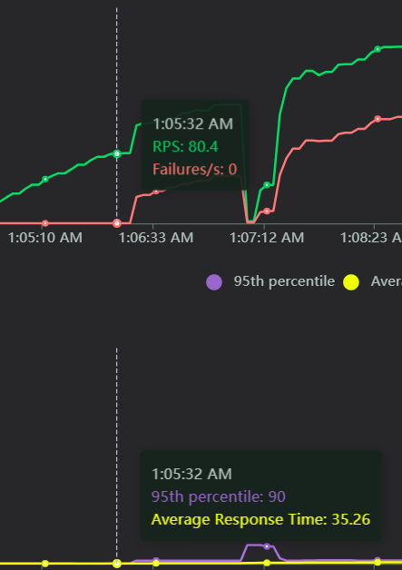
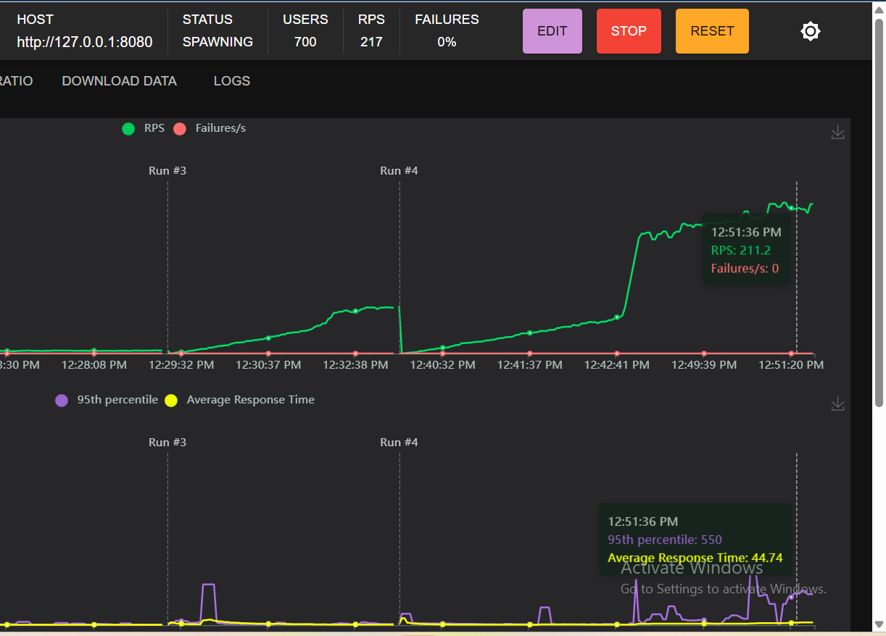

# Динамическое масштабирование контейнеров

## Масштабирование на основании памяти
В ходе нагрузочного тестирования выяснилось, что вероятно масштабирование по памяти не подходит для данного приложения.
При росте нагрузки до 80 RPS дальнейшее увеличение ведет к росту отказов, хотя при этом количество потребления памяти остается умеренным и не достигает порогового значения.

## Масштабирование на основании RPS
Нагрузка 800 users ramp up 1 u/s
Поды успешно масштабировались с 1 до 10 [лог событий деплоймента](./scale-by-rps.log) 

